***此实验是对[校园网规划与设计](https://zjj0707.blog.csdn.net/article/details/114052436?spm=1001.2014.3001.5506)一文的实现与补充*** 
-----

# 一.设计要求
1. 该网络至少需要有9个网段（每个网段至少2台主机（两个IP地址）），每个网段的起始地址段为：192.168.18 开头。
2. 拓扑图至少有5台路由器，核心层为2台三层交换机，汇聚层3台交换机，接入层6台交换机。
3. 本设计模拟一个校园网的规划与设计，该校园有三个园区，东区、南区和北区。园区网外部路由（东区、南区和北区路由器）之间的链路层协议选用PPP、路由协议选用rip。
4. 园区网边界路由器启用NAT技术。
5. 画出网络拓扑图。
6. 在设计中要涉及虚拟局域网，在接入层交换机配置VLAN。
7. 在两台核心交换机之间提供冗余链路。
8. 需要有Web网站的管理:具备WWW,FTP功能,配置Web服务器。
9. 需要配置DHCP服务。
10. 体现策略路由。
11. VRRP技术的运用(本实验采用HSRP)
12. 体现IPsec技术
13. 体现PVST技术

# 二.拓扑图设计


# 三.主要技术
- **VLAN功能简介:** 通过vlan划分网段,隔离广播域.
- **链路聚合简介:** 牺牲端口数来给交换机之间的数据交换提供捆绑的高带宽,提供负载均衡能力以及系统容错.
- **HSRP功能简介:** HSRP把多台路由器形成一个虚拟路由器。这个组内只有一个路由器是Active(活动)的，并由它来转发数据包，如果活动路由器发生了故障，备份路由器将成为活动路由器。从网络内的主机来看，网关并没有改变。
- **MSTP功能简介:** 通过设计优先级来阻塞端口，可以解决交换机冗余链路环路问题.(MSTP可以按vlan来阻塞冗余链路)
- **静态路由功能简介:** 因为公网路由路由器器很多，如果边界配置动态路由，则边界路由器学习的路由记录就很多，会很占路由器内存及查找效率。所以只能采用默认路由.
- **动态路由简介RIP:** 公网有很多路由器采用人工分配的工作量大，所以采用RIP协议.
- **DHCP功能简介:** 学校的主机很多，人工分配ip的工作量大，所以采用DHCP服务自动获取.
- **NAT功能简介:** 学校局域网用的都是私有地址，需要把私有地址转换映射成公网地址才能访问公网.
- **Ipsec功能简介:** 学校局域网是私有的，互联网用户不能访问，所以要配置VPN加密通道.
- **GRE功能简介:** 各校区园区的局域网是独立的，要实现各校区互通，要配置GER隧道，忽略公网路由器，直接看成一条网线连接园区边界路由器。

# 四.设备配置
## 1.东区园区配置
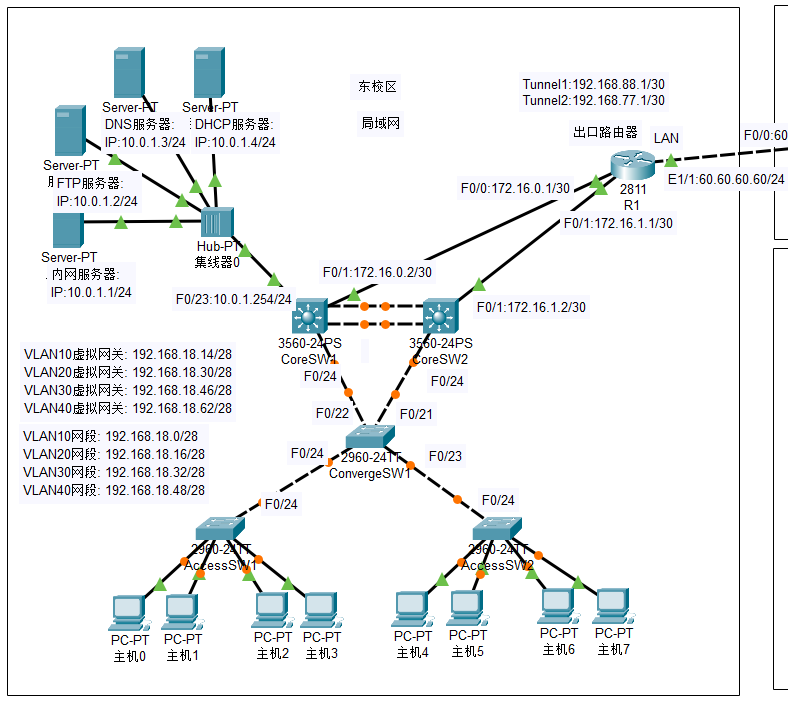
### 1.1.各设备及其端口ip地址
- **服务器组**
**内网服务器**
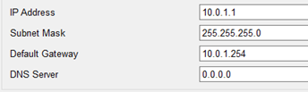
**FTP服务器**
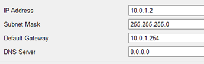
**DNS服务器**
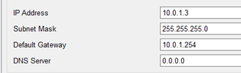
**DHCP服务器**
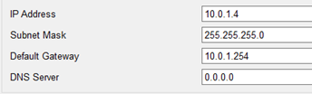

- **核心层交换机 CoreSW1**
```r
CoreSW1(config)#int f0/1
CoreSW1(config-if)#no switchport
CoreSW1(config-if)#ip address 172.16.0.2 255.255.255.252
CoreSW1(config-if)#int f0/23
CoreSW1(config-if)#no switchport 
CoreSW1(config-if)#ip address 10.0.1.254 255.255.255.0
```
[no switchport](https://blog.csdn.net/chengxiug/article/details/88902274)


- **核心层交换机 CoreSW2**
```r
CoreSW2(config)#int f0/1
CoreSW2(config-if)#no switchport 
CoreSW2(config-if)#ip address 172.16.1.2 255.255.255.252
```

- **路由器 R1**
```r
R1(config)#int f0/0
R1(config-if)#no shutdown
R1(config-if)#ip address 172.16.0.1 255.255.255.252
R1(config-if)#int f0/1
R1(config-if)#no shutdown
R1(config-if)#ip address 172.16.1.1 255.255.255.252
R1(config-if)#int e1/1
R1(config-if)#no shutdown
R1(config-if)#ip address 60.60.60.60 255.255.255.252
```

### 1.2.VLAN及其主干链路
- **接入层交换机 AccessSW1**
```r
AccessSW1(config)#vlan 10
AccessSW1(config-vlan)#vlan 20
AccessSW1(config-vlan)#int range f0/1-10
AccessSW1(config-if-range)#switchport access vlan 10
AccessSW1(config-if-range)#int range f0/11-20
AccessSW1(config-if-range)#switchport access vlan 20
AccessSW1(config-if)#int f0/24
AccessSW1(config-if)#switchport mode trunk
```
- **接入层交换机 AccessSW2**
```r
AccessSW2(config)#vlan 30
AccessSW2(config-vlan)#vlan40
AccessSW2(config-vlan)#int range f0/1-10
AccessSW2(config-if-range)#switchport access vlan 30
AccessSW2(config-if-range)#int range f0/11-20
AccessSW2(config-if-range)#switchport access vlan 40
AccessSW2(config-if)#int f0/24
AccessSW2(config-if)#switchport mode trunk
```
- **汇聚层交换机 ConvergeSW1**
```r
ConvergeSW1 (config)#vlan 10
ConvergeSW1 (config-vlan)#vlan 20
ConvergeSW1 (config-vlan)#vlan 30
ConvergeSW1 (config-vlan)#vlan 40
ConvergeSW1 (config)#int range f0/21-24
ConvergeSW1 (config-if-range)#switchport mode trunk
```
- **核心层交换机 CoreSW1**
```r
CoreSW1(config)#ip routing
CoreSW1(config)#vlan 10
CoreSW1(config-vlan)#vlan 20
CoreSW1(config-vlan)#vlan 30
CoreSW1(config-vlan)#vlan 40
CoreSW1(config-vlan)#int f0/24
CoreSW1(config-if)#switchport trunk encapsulation dot1q
CoreSW1(config-if)#switchport mode trunk
CoreSW1(config-if)#int port-channel 1
CoreSW1(config-if)#switchport trunk encapsulation dot1q
CoreSW1(config-if)#switchport mode trunk
CoreSW1(config)#int vlan 10
CoreSW1(config-if)#ip address 192.168.18.1 255.255.255.240
CoreSW1(config-if)#int vlan 20
CoreSW1(config-if)#ip address 192.168.18.17 255.255.255.240
CoreSW1(config-if)#int vlan 30
CoreSW1(config-if)#ip address 192.168.18.33 255.255.255.240
CoreSW1(config-if)#int vlan 40 
CoreSW1(config-if)#ip address 192.168.18.49 255.255.255.240
```
[switchport trunk encapsulation dot1q](https://blog.csdn.net/NordesertWolf/article/details/53071033)
[Port-Channel 实例](https://www.cnblogs.com/qzqdy/p/8336858.html)

- **核心层交换机 CoreSW2**
```r
CoreSW2(config)#ip routing
CoreSW2(config)#vlan 10
CoreSW2(config-vlan)#vlan 20
CoreSW2(config-vlan)#vlan 30
CoreSW2(config-vlan)#vlan 40
CoreSW2(config)#int f0/24
CoreSW2(config-if)#switchport trunk encapsulation dot1q
CoreSW2(config-if)#switchport mode trunk
CoreSW2(config-if)#int port-channel 1
CoreSW2(config-if)#switchport trunk encapsulation dot1q
CoreSW2(config-if)#switchport mode trunk
CoreSW2(config)#int vlan 10
CoreSW2(config-if)#ip address 192.168.18.2 255.255.255.240
CoreSW2(config-if)#int vlan 20
CoreSW2(config-if)#ip address 192.168.18.18 255.255.255.240
CoreSW2(config-if)#int vlan 30
CoreSW2(config-if)#ip address 192.168.18.34 255.255.255.240
CoreSW2(config-if)#int vlan 40
CoreSW2(config-if)#ip address 192.168.18.50 255.255.255.240
```

### 1.3.链路聚合
- **核心层交换机 CoreSW1**
```r
convergeSW1 (config)#int range g0/1-2
convergeSW1 (config-if-range)#channel-group 1 mode on
```
- **核心层交换机 CoreSW2**
```r
ConvergeSW2 (config)#int range g0/1-2
ConvergeSW2 (config-if-range)#channel-group 1 mode on
```

### 1.4.网关冗余HSRP

==**!实测Cisco Packet Tracer5.3 不支持HSRP协议与VRRP协议配置**==

**(通过优先级控制CoreSW1 为vlan10,30的主设备,  CoreSW2 为vlan20,40的主设备)**

[HSRP 详解](https://blog.csdn.net/zonghua521/article/details/78198024)
[HSRP 配置实例](https://blog.csdn.net/kadwf123/article/details/103700247)

- **核心层交换机 CoreSW1**
```r
CoreSW1(config-if)#int vlan 10
CoreSW1(config-if)#standby 1 ip 192.168.18.14
CoreSW1(config-if)#standby 1 preempt
CoreSW1(config-if)#standby 1 priority 110
CoreSW1(config-if)#standby 1 track f0/1
CoreSW1(config-if)#int vlan 20
CoreSW1(config-if)#standby 1 ip 192.168.18.30
CoreSW1(config-if)#standby 1 preempt
CoreSW1(config-if)#standby 1 priority 105
CoreSW1(config-if)#standby 1 track f0/1
CoreSW1(config-if)#int vlan 30
CoreSW1(config-if)#standby 1 ip 192.168.18.46
CoreSW1(config-if)#standby 1 preempt
CoreSW1(config-if)#standby 1 priority 110
CoreSW1(config-if)#standby 1 track f0/1
CoreSW1(config-if)#int vlan 40
CoreSW1(config-if)#standby 1 ip 192.168.18.62
CoreSW1(config-if)#standby 1 preempt
CoreSW1(config-if)#standby 1 priority 105
CoreSW1(config-if)#standby 1 track f0/1
```
- **核心层交换机 CoreSW2**
```r
CoreSW2(config-if)#int vlan 10
CoreSW2(config-if)#standby 1 ip 192.168.18.14
CoreSW2(config-if)#standby 1 preempt
CoreSW2(config-if)#standby 1 priority 105
CoreSW2(config-if)#standby 1 track f0/1
CoreSW2(config-if)#int vlan 20
CoreSW2(config-if)#standby 1 ip 192.168.18.30
CoreSW2(config-if)#standby 1 preempt
CoreSW2(config-if)#standby 1 priority 110
CoreSW2(config-if)#standby 1 track f0/1
CoreSW2(config-if)#int vlan 30
CoreSW2(config-if)#standby 1 ip 192.168.18.46
CoreSW2(config-if)#standby 1 preempt
CoreSW2(config-if)#standby 1 priority 105
CoreSW2(config-if)#standby 1 track f0/1
CoreSW2(config-if)#int vlan 40
CoreSW2(config-if)#standby 1 ip 192.168.18.62
CoreSW2(config-if)#standby 1 preempt
CoreSW2(config-if)#standby 1 priority 110
CoreSW2(config-if)#standby 1 track f0/1
```
- 配置完成后 **show standby brief**
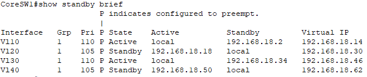
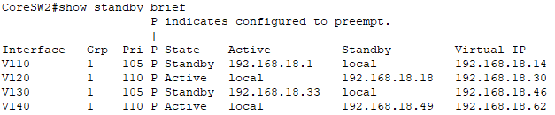

### 1.5.生成树协议MSTP

**( 根网桥唯一的依据是BID最小。BID分为两个部分：优先级+MAC地址。比较BID时，先比较优先级，如果优先级相同才比较MAC地址。)**
[MSTP配置实例](https://blog.csdn.net/qq_47587299/article/details/124460140)
[MSTP基础配置](https://blog.csdn.net/qq_42248536/article/details/88974183)


配置CoreSW1为vlan10,30的主根,vlan20,40的次根
配置CoreSW2为vlan20,40的主根,vlan10,30的次根

- **汇聚层交换机 ConvergeSW1**
```r
ConvergeSW1(config)#spanning-tree vlan 10,20,30,40
```
- **核心层交换机 CoreSW1**
```r
CoreSW1(config)#spanning-tree vlan 10 priority 0
CoreSW1(config)#spanning-tree vlan 20 priority 4096
CoreSW1(config)#spanning-tree vlan 30 priority 0
CoreSW1(config)#spanning-tree vlan 40 priority 4096
```
- **核心层交换机 CoreSW2**
```r
CoreSW2(config)#spanning-tree vlan 10 priority 4096
CoreSW2(config)#spanning-tree vlan 20 priority 0
CoreSW2(config)#spanning-tree vlan 30 priority 4096
CoreSW2(config)#spanning-tree vlan 40 priority 0
```

### 1.6.路由表
#### 静态路由
- **核心层交换机 CoreSW1**
```r
CoreSW1(config)#ip route 0.0.0.0 0.0.0.0 172.16.0.1
```
- **核心层交换机 CoreSW2**
```r
CoreSW2(config)#ip route 0.0.0.0 0.0.0.0 172.16.1.1
```
- **路由器 R1**
```r
R1(config)#ip route 192.168.18.0 255.255.255.0 172.16.0.2
R1(config)#ip route 192.168.18.0 255.255.255.0 172.16.1.2
R1(config)#ip route 10.0.1.0 255.255.255.0 172.16.0.2
R1(config)#ip route 10.0.1.0 255.255.255.0 172.16.1.2
R1(config)#ip route 0.0.0.0 0.0.0.0 60.60.60.1
R1(config)#ip route 192.168.18.64 255.255.255.240 192.168.88.2
R1(config)#ip route 192.168.18.80 255.255.255.240 192.168.88.2
R1(config)#ip route 192.168.18.96 255.255.255.240 192.168.88.2
R1(config)#ip route 192.168.18.112 255.255.255.240 192.168.88.2
R1(config)#ip route 192.168.18.128 255.255.255.240 192.168.88.2
```
(后五条 目的地址为其他校区vlan网段,下一跳地址为gre隧道ip地址)
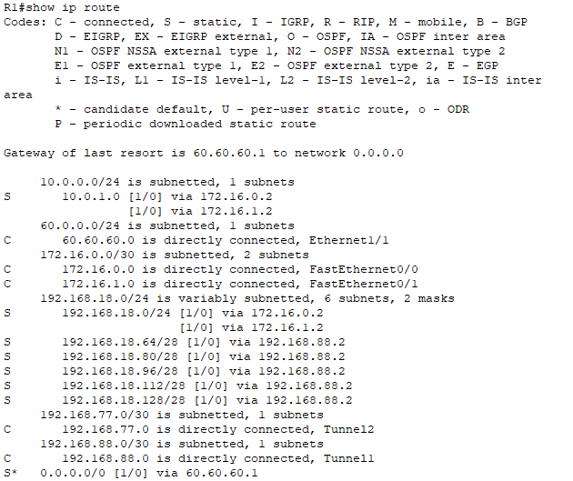


### 1.7.DHCP
[DHCP配置](https://blog.csdn.net/qq_41745698/article/details/85019218)

- **DHCP服务器**
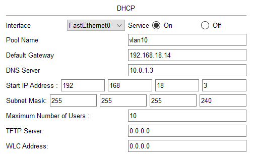
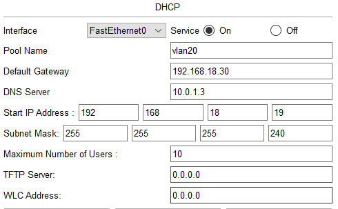
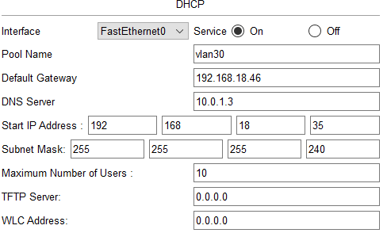
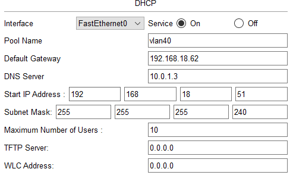
- **核心层交换机 CoreSW1**
```r
CoreSW1(config)#service dhcp
CoreSW1(config)#int vlan 10
CoreSW1(config-if)#ip helper-address 10.0.1.4 //指定dhcp服务器的地址，通过vlan10 向该服务器发送DHCP请求包
CoreSW1(config-if)#int vlan 20
CoreSW1(config-if)# ip helper-address 10.0.1.4
CoreSW1(config-if)#int vlan 30
CoreSW1(config-if)# ip helper-address 10.0.1.4
CoreSW1(config-if)#int vlan 40
CoreSW1(config-if)# ip helper-address 10.0.1.4
```
- **核心层交换机 CoreSW2**
```r
CoreSW2(config)#service dhcp
CoreSW2(config)#int vlan 10
CoreSW2(config-if)#ip helper-address 10.0.1.4
CoreSW2(config-if)#int vlan 20
CoreSW2(config-if)# ip helper-address 10.0.1.4
CoreSW2(config-if)#int vlan 30
CoreSW2(config-if)# ip helper-address 10.0.1.4
CoreSW2(config-if)#int vlan 40
CoreSW2(config-if)# ip helper-address 10.0.1.4
```


### 1.8.NAT地址转换
**定义连接内外网接口,配置访问控制列表**

- **路由器 R1**
```r
R1(config)#int range f0/0-1
R1(config-if)#ip nat inside
R1(config-if)#int e1/1
R1(config)#ip nat outside
R1(config-if)#access-list 10 permit 10.0.1.0 0.0.0.255
R1(config)#access-list 10 permit 192.168.18.0 0.0.0.255
R1(config)# ip nat inside source list 10 interface Ethernet1/1 overload
```
### 1.9.ipsec VPN
- ISAKMP/IKE传输集就是一组用来保护管理连接的安全措施，主要包括以下几个方面：
 加密算法：DES、3DES和AES；
 HMAC算法：MD5或SHA-1；
 设备验证的类型：预共享密钥；
 DH密钥组：Cisco支持1、2、5、7（Cisco路由器不支持密钥组7）；
 管理连接的生存周期. 

1. 配置一个ISAKMP策略
   激活路由器上的ISAKMP（和IKE）
   每一个策略实体定义五个策略参数(ike策略加密,策略哈希,密钥交换,寿命,认证方式)

2. IKE模式配置
-  IKE模式配置有三个部分
    - 第一部分是ISAKMP客户端组:
      这是使用命令<crypto isakmp client configuration group {group name}>创建的。这个命令定义了大多数的客户端配置和组策略信息，这些信息是用于支持IPsec客户端连接的。
    - 第二部分是一个客户端IP地址池的创建:
      IP地址是客户端配置组分配IP给客户端的地方。它是通过使用全局配置命令<ip local pool {pool-name} {start-ip} {end-ip}>来创建的。
    - 最后一部分是半隧道的客户端访问策略访问控制列表（ACL）.

[IPsec ×××路由器配置：ISAKMP策略](https://blog.csdn.net/weixin_33951761/article/details/91744965)
[配置AAA认证和授权](https://blog.csdn.net/weixin_42442713/article/details/88980902)
[CIsco路由器实现IPSec 虚拟专用网原理及配置详解](https://blog.csdn.net/weixin_45186298/article/details/102877901?utm_medium=distribute.pc_relevant.none-task-blog-2~default~baidujs_baidulandingword~default-1-102877901-blog-107681185.pc_relevant_antiscanv2&spm=1001.2101.3001.4242.2&utm_relevant_index=4)

- **路由器 R1**
```r
R1(config)#ip nat inside source static tcp 10.0.1.1 80 60.60.60.60 80  //静态nat
R1(config)#aaa new-model                                   //全局启用AAA
R1(config)#aaa authentication login vec-a local            //配置当用户登录设备时，使用AAA本地登录认证方式，自定义认证列表调用vec-a，认证方式为local。
R1(config)#aaa authorization network vec-o local           //“aaa authorization”是指连接到交换机的设备的授权
R1(config)#username vec password 0 123                     // 0表示明文
R1(config)#crypto isakmp policy 10                         //用于建立建立ISAKMP/IKE的管理连接策略；(每个策略对应一个序列号，范围从1~10000，数值越低，优先级越高；)
R1(config-isakmp)#hash md5                                 //指定了验证过程采用的散列算法
R1(config-isakmp)#authentication pre-share                 //指定设备身份验证的方式{pre-shara（预共享密钥）| rsa-encr | rsa-sig}
R1(config-isakmp)#crypto isakmp client configuration group vecgroup
R1(config-isakmp-group)#key vec
R1(config-isakmp-group)#pool vecpool
R1(config-isakmp-group)#crypto ipsec transform-set map esp-3des esp-md5-hmac      //定义传输集名称（名称必须是唯一的），后面就是一些选项(使用esp-3des加密，解密使用esp-md5-hmac算法)
R1(config)#crypto dynamic-map d-map 10                     //创建一个名为d-map的dynamic-map,序列号为10
R1(config-crypto-map)#set transform-set map                //指定传输集的名称
R1(config-crypto-map)#reverse-route
R1(config-crypto-map)#crypto map map client authentication list vec-a
R1(config)#crypto map map isakmp authorization list vec-o
R1(config)#crypto map map client configuration address respond
R1(config)#crypto map map 10 ipsec-isakmp dynamic d-map
R1(config)#ip local pool vecpool 192.168.18.243 192.168.18.253
R1(config)#int e1/1
R1(config-if)#crypto map map                              //在连接公网接口上调用Crypto-Map
*Jan 3 07:16:26.785: %CRYPTO-6-ISAKMP_ON_OFF: ISAKMP is ON
```
### 1.10.GRE隧道
[Cisco思科路由器配置GRE通道的简单例子](https://blog.csdn.net/qq_20388417/article/details/104751783)
- **路由器 R1**
```r
R1(config)#int tunnel 1
R1(config-if)#tunnel source e1/1
R1(config-if)#tunnel destination 50.50.50.50
R1(config-if)#ip address 192.168.88.1 255.255.255.252
R1(config-if)#int tunnel 2 
R1(config-if)#tunnel source e1/1
R1(config-if)#tunnel destination 40.40.40.40
R1(config-if)#ip address 192.168.77.1 255.255.255.252
```
## 2.南校区配置
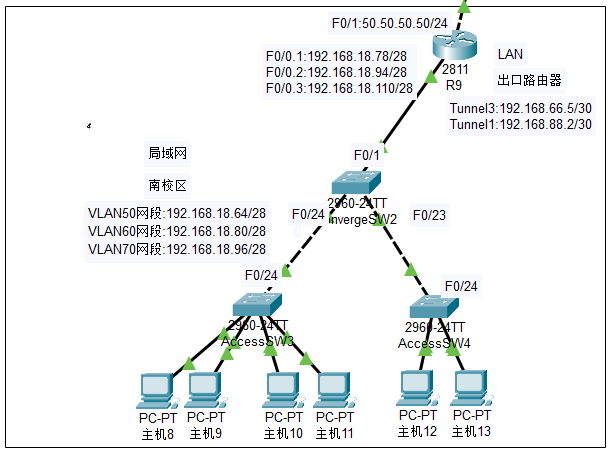
### 2.1.各设备及端口ip地址
- **路由器 R9**
```r
R9(config)#int f0/1
R9(config-if)#no shutdown
R9(config-if)#ip address 50.50.50.50 255.255.255.0
R9(config-if)#int f0/0
R9(config-if)#no shutdown
R9(config-if)#no ip address
R9(config-if)#int f0/0.1
R9(config-if)#encapsulation dot1q 50
R9(config-if)#ip address 192.168.18.78 255.255.255.240
R9(config-if)#int f0/0.2
R9(config-if)#encapsulation dot1q 60
R9(config-if)#ip address 192.168.18.94 255.255.255.240
R9(config-if)#int f0/0.3
R9(config-if)#encapsulation dot1q 70
R9(config-if)#ip address 192.168.18.110 255.255.255.240
```

### 2.2.VLAN技术
- **接入层交换机 AccessSW3**
```r
AccessSW3(config)#vlan 50
AccessSW3(config)#vlan 60
AccessSW3(config)#int range f0/1-10
AccessSW3(config-if)#switchport access vlan 50
AccessSW3(config-if)#int range f0/11-20
AccessSW3(config-if)#switchport access vlan 60
AccessSW3(config-if)#int f0/24
AccessSW3(config-if)#switchport mode trunk
```
- **接入层交换机 AccessSW4**
```r
AccessSW4(config)#vlan 70
AccessSW4(config)#int range f0/1-20
AccessSW4(config-if)#switchport access vlan 70
AccessSW4(config-if)#int f0/24
AccessSW4(config-if)#switchport mode trunk
```
- **核心层交换机 ConvergeSW2**
```r
ConvergeSW2(config)#vlan 50
ConvergeSW2(config)#vlan 60
ConvergeSW2(config)#vlan 70
ConvergeSW2(config)#int f0/1
ConvergeSW2(config-if)#switchport mode trunk
ConvergeSW2(config-if)#int range f0/23-24
ConvergeSW2(config-if)#swithcport mode trunk
```

### 2.3.路由表
#### 静态路由
- **路由器 R9**
```r
R9(config)#ip route 0.0.0.0 0.0.0.0 50.50.50.1
R9(config)#ip route 10.0.1.0 255.255.255.0 192.168.88.1
R9(config)#ip route 192.168.18.0 255.255.255.240 192.168.88.1
R9(config)#ip route 192.168.18.16 255.255.255.240 192.168.88.1
R9(config)#ip route 192.168.18.32 255.255.255.240 192.168.88.1
R9(config)#ip route 192.168.18.48 255.255.255.240 192.168.88.1
R9(config)#ip route 192.168.18.112 255.255.255.240 192.168.66.6
R9(config)#ip route 192.168.18.128 255.255.255.240 192.168.66.6
```

### 2.4.DHCP
[Cisco Packet Tracer中配置DHCP服务器](https://blog.csdn.net/qq_41745698/article/details/85019218)
- **路由器 R9**
```r
R9(config)#service dhcp
R9(config)#ip dhcp pool 50                        //配置IP地址池的名称，并进入DHCPPool配置模式
R9(config)#network 192.168.18.64 255.255.255.240  //配置IP地址池的子网地址和子网掩码
R9(config)#default-router 192.168.18.78           //配置IP地址池的缺省网关
R9(config)#dns-server 10.0.1.3                    //配置IP地址池的域名服务器的IP地址
R9(config)#ip dhcp excluded-address 192.168.18.78 //配置不用于动态分配的IP地址（除外地址）
R9(config)#ip dhcp pool 60
R9(config)#network 192.168.18.80 255.255.255.240
R9(config)#default-router 192.168.18.94
R9(config)#dns-server 10.0.1.3
R9(config)#ip dhcp excluded-address 192.168.18.94
R9(config)#ip dhcp pool 70
R9(config)#network 192.168.18.96 255.255.255.240
R9(config)#default-router 192.168.18.110
R9(config)#dns-server 10.0.1.3
R9(config)#ip dhcp excluded-address 192.168.18.110
```

#### 2.5.NAT地址转换
- **路由器 R9**
```r
R9(config)#int range f0/0.1-0.3
R9(config-if)#ip nat inside
R9(config-if)#int f0/1
R9(config)#ip nat outside
R9(config)#access-list 10 permit 192.168.18.0 0.0.0.255
R9(config)# ip nat inside source list 10 interface f0/1 overload
```

### 2.6.GRE隧道
- **路由器 R9**
```r
R9(config)#int tunnel 1
R9(config-if)#tunnel source f0/1
R9(config-if)#tunnel destination 60.60.60.60
R9(config-if)#ip address 192.168.88.2 255.255.255.252
R9(config-if)#int tunnel 2 
R9(config-if)#tunnel source f0/1
R9(config-if)#tunnel destination 40.40.40.40
R9(config-if)#ip address 192.168.66.5 255.255.255.252
```

## 3.北区园区配置
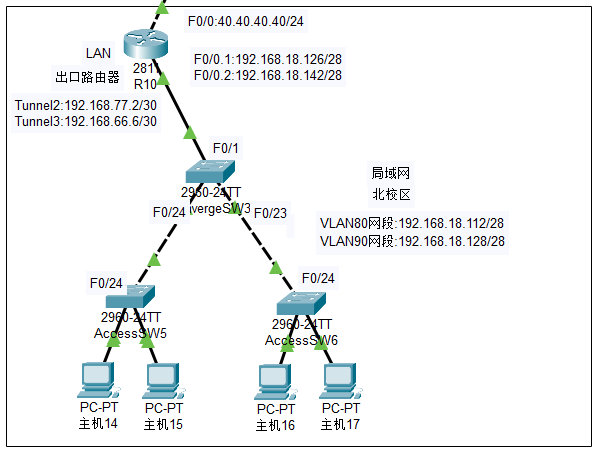
### 3.1.各设备及端口ip地址
- **路由器 R10**
```r
R10(config)#int f0/1
R10(config-if)#no shutdown
R10(config-if)#ip address 40.40.40.40 255.255.255.0
R10(config-if)#int f0/0
R10(config-if)#no shutdown
R10(config-if)#no ip address
R10(config-if)#int f0/0.1
R10(config-if)#encapsulation dot1q 80
R10(config-if)#ip address 192.168.18.126 255.255.255.240
R10(config-if)#int f0/0.2
R10(config-if)#encapsulation dot1q 90
R10(config-if)#ip address 192.168.18.142 255.255.255.240
```

### 3.2.VLAN技术
- **接入层交换机 AccessSW5**
```r
AccessSW5(config)#vlan 80
AccessSW5(config)#int range f0/1-20
AccessSW5(config-if)#switchport access vlan 80
AccessSW5(config-if)#int f0/24
AccessSW5(config-if)#switchport mode trunk
```
- **接入层交换机 AccessSW6**
```r
AccessSW6(config)#vlan 90
AccessSW6(config)#int range f0/1-20
AccessSW6(config-if)#switchport access vlan 90
AccessSW6(config-if)#int f0/24
AccessSW6(config-if)#switchport mode trunk
```
- **汇聚层交换机 ConvergeSW3**
```r
ConvergeSW3(config)#vlan 80
ConvergeSW3(config)#vlan 90
ConvergeSW3(config)#int f0/1
ConvergeSW3(config-if)#switchport mode trunk
ConvergeSW3(config-if)#int range f0/23-24
ConvergeSW3(config-if)#swithcport mode trunk
```

### 3.3.路由表
#### 静态路由
- **路由器 R10**
```r
R10(config)#ip route 0.0.0.0 0.0.0.0 40.40.40.1
R10(config)#ip route 10.0.1.0 255.255.255.0 192.168.77.1
R10(config)#ip route 192.168.18.0 255.255.255.240 192.168.77.1
R10(config)#ip route 192.168.18.16 255.255.255.240 192.168.77.1
R10(config)#ip route 192.168.18.32 255.255.255.240 192.168.77.1
R10(config)#ip route 192.168.18.48 255.255.255.240 192.168.77.1
R10(config)#ip route 192.168.18.64 255.255.255.240 192.168.66.5
R10(config)#ip route 192.168.18.80 255.255.255.240 192.168.66.5
R10(config)#ip route 192.168.18.96 255.255.255.240 192.168.66.5
```

### 3.4.DHCP
- **路由器 R10**
```r
R10(config)#service dhcp
R10(config)#ip dhcp pool 80
R10(config)#network 192.168.18.112 255.255.255.240
R10(config)#default-router 192.168.18.126
R10(config)#dns-server 10.0.1.3
R10(config)#ip dhcp excluded-address 192.168.18.126
R10(config)#ip dhcp pool 90
R10(config)#network 192.168.18.128 255.255.255.240
R10(config)#default-router 192.168.18.142
R10(config)#dns-server 10.0.1.3
R10(config)#ip dhcp excluded-address 192.168.18.142
```

### 3.5.NAT地址转换
- **路由器 R10**
```r
R10(config)#int range f0/0.1-0.2
R10(config-if)#ip nat inside
R10(config-if)#int f0/1
R10(config)#ip nat outside
R10(config)#access-list 10 permit 192.168.18.0 0.0.0.255
R10(config)# ip nat inside source list 10 interface f0/1 overload
```

### 3.6.GRE隧道
- **路由器 R10**
```r
R10(config)#int tunnel 2
R10(config-if)#tunnel source f0/1
R10(config-if)#tunnel destination 60.60.60.60
R10(config-if)#ip address 192.168.77.2 255.255.255.252
R10(config-if)#int tunnel 3 
R10(config-if)#tunnel source f0/1
R10(config-if)#tunnel destination 50.50.50.50
R10(config-if)#ip address 192.168.66.6 255.255.255.252

```


## 4.公网配置
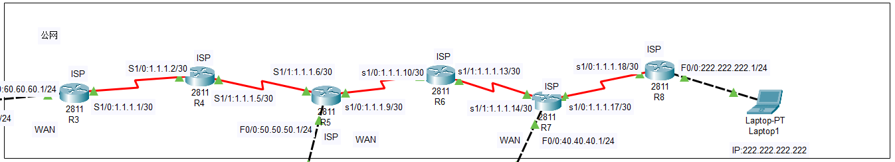
### 4.1.各设备端口ip地址
- **路由器 R3**
```r
R3(config)#int f0/0
R3(config-if)#no shutdown
R3(config-if)#ip address 60.60.60.1 255.255.255.0
R3(config-if)#int s1/0
R3(config-if)#no shutdown
R3(config-if)#ip address 1.1.1.1 255.255.255.252
```
- **路由器 R4**
```r
R4(config)#int s1/0
R4(config-if)#no shutdown
R4(config-if)#ip address 1.1.1.2 255.255.255.252
R4(config-if)#int s1/1
R4(config-if)#no shutdown
R4(config-if)#ip address 1.1.1.5 255.255.255.252
```
- **路由器 R5**
```r
R5(config)#int s1/1
R5(config-if)#no shutdown
R5(config-if)#ip address 1.1.1.6 255.255.255.252
R5(config-if)#int s1/0
R5(config-if)#no shutdown
R5(config-if)#ip address 1.1.1.9 255.255.255.252
R5(config-if)#int f0/0
R5(config-if)#no shutdown
R5(config-if)#ip address 50.50.50.1 255.255.255.0
```
- **路由器 R6**
```r
R6(config)#int s1/0
R6(config-if)#no shutdown
R6(config-if)#ip address 1.1.1.10 255.255.255.252
R6(config-if)#int s1/1
R6(config-if)#no shutdown
R6(config-if)#ip address 1.1.1.13 255.255.255.252
```
- **路由器 R7**
```r
R7(config)#int s1/1
R7(config-if)#no shutdown
R7(config-if)#ip address 1.1.1.14 255.255.255.252
R7(config-if)#int s1/0
R7(config-if)#no shutdown
R7(config-if)#ip address 1.1.1.17 255.255.255.252
R7(config-if)#it f0/0 
R7(config-if)#no shutdown
R7(config-if)#ip address 40.40.40.1 255.255.255.0
```
- **路由器 R8**
```r
R8(config)#int s1/0
R8(config-if)#no shutdown
R8(config-if)#ip address 1.1.1.18 255.255.255.252
R8(config-if)#int f0/0
R8(config-if)#no shutdown
R8(config-if)#ip address 222.222.222.1 255.255.255.0
```

### 4.2.路由表
#### 动态rip路由配置
- **路由器 R3**
```r
R3(config)#router rip
R3(config-router)#version 2
R3(config-router)#no auto-summary
R3(config-router)#network 1.1.1.0
R3(config-router)#network 60.60.60.0
```
- **路由器 R4**
```r
R4(config)#router rip
R4(config-router)#version 2
R4(config-router)#no auto-summary
R4(config-router)#network 1.1.1.0
```
- **路由器 R5**
```r
R5(config)#router rip
R5(config-router)#version 2
R5(config-router)#no auto-summary
R5(config-router)#network 1.1.1.0
R5(config-router)#network 50.50.50.0
```
- **路由器 R6**
```r
R6(config)#router rip
R6(config-router)#version 2
R6(config-router)#no auto-summary
R6(config-router)#network 1.1.1.0
```
- **路由器 R7**
```r
R7(config)#router rip
R7(config-router)#version 2
R7(config-router)#auto-summary
R7(config-router)#network 1.1.1.0
R7(config-router)#network 40.40.40.0
```
- **路由器 R8**
```r
R8(config)#router rip
R8(config-router)#version 2
R8(config-router)#no auto-summary
R8(config-router)#network 1.1.1.0
R8(config-router)#network 222.222.222.0
```

#### 静态路由配置
- **路由器 R3**
```r
R3(config)#ip route 0.0.0.0 0.0.0.0 60.60.60.60
```
- **路由器 R4**
```r
R4(config)#ip route 0.0.0.0 0.0.0.0 1.1.1.1
```
- **路由器 R5**
```r
R5(config)#ip route 0.0.0.0 0.0.0.0 1.1.1.5
```
- **路由器 R6**
```r
R6(config)#ip route 0.0.0.0 0.0.0.0 1.1.1.9
```
- **路由器 R7**
```r
R7(config)#ip route 0.0.0.0 0.0.0.0 1.1.1.13
```
- **路由器 R8**
```r
R7(config)#ip route 0.0.0.0 0.0.0.0 1.1.1.17
```

## 5.服务器
- **DNS服务器**
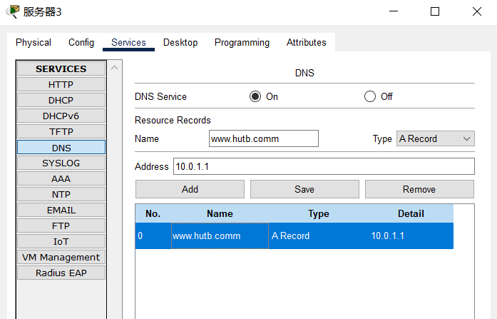
- **FTP服务器**
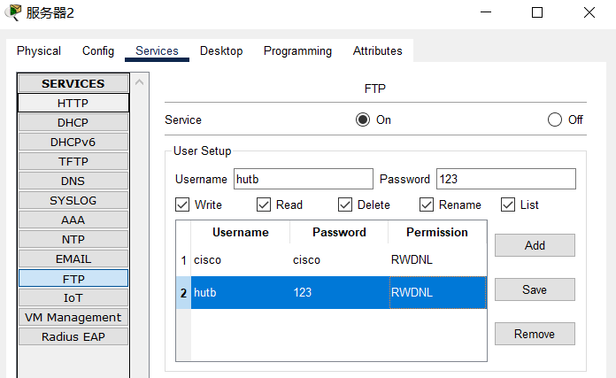

## 6.检测是否联通
- **Laptop1**
(ip address: 222.222.222.222)
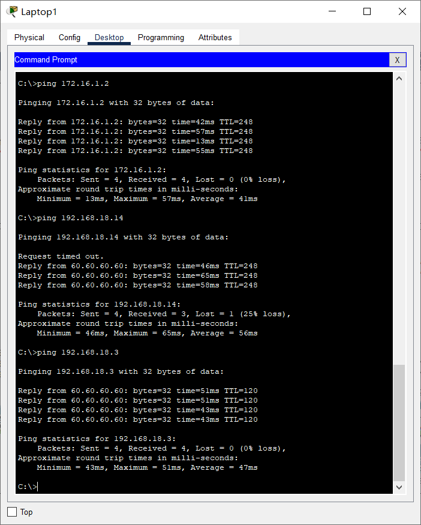
- **主机1**
(ip address: 192.168.18.4  )
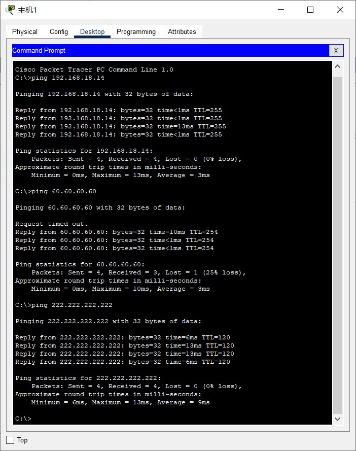


