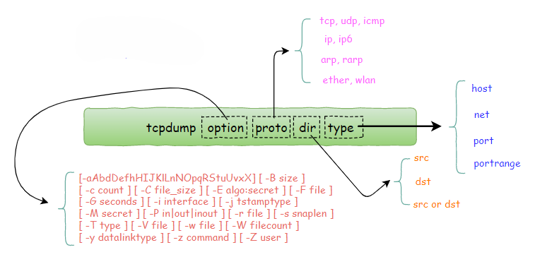

# Linux
## 常用命令/工具
### [tcpdump  网络数据采集分析工具](https://www.cnblogs.com/wongbingming/p/13212306.html)
        
### sed 
- sed是一个流编辑器，主要用于对文本进行非交互式编辑。它可以进行插入、删除、替换、提取等操作，是文本处理和转换的利器。 
- 功能： 
  - 文本替换和删除
  - 模式匹配和文本插入
  - 支持脚本编写进行复杂的文本处理
  - 数据流操作
#### 基本格式
**`sed [选项参数] 'script' [file] `**
#### 参数说明
1. script：sed 内置的命令字符。主要是用于对文件进行增删改查等操作。 
      常见内置命令字符：
      | Charater        | Content        |
      | ----------- | ----------- |
      | a   | 表示对文本进行追加操作，在指定行后面添加一行或多行文本 |
      | d   | 表示删除匹配行 |
      | i    | 表示插入文本，在指定行前添加一行或多行文本 |
      | p   | 表示打印匹配行内容，通常与-n一同使用 |
      | s/正则/替换内容/g   | 表示匹配正则内容, 然后替换内容（支持正则表达式）结尾g表示全局匹配 |
2. file：要处理的输入文件。若不指定文件，sed会从标准输入读取。 
3. 常用选项参数： 
      | Charater        | Content        |
      | ----------- | ----------- |
      | -n   | 表示取消默认的sed输出，通常与sed内置命令p一起使用 |
      | -e script   | script 直接在命令行上添加要执行的sed脚本 |
      | -f script-file    | script-file 从脚本文件中读取sed命令 |
      | -i [SUFFIX]   | 直接修改文件内容，而不是输出到标准输出。可以选择性地备份文件。如果不加-i，sed修改的是内存数据。 |
      | -r   | 使用扩展正则表达式 s 将文件视为独立的文件，而不是单一的流 | 
4. [常用命令举例](https://blog.csdn.net/qq_39512532/article/details/140274261)
### shell (命令语言解释器,Linux user和kernel间的接口程序)
- shell script
  1. 常用命工具及命令
     - sed
     - awk
     - 正则表达式匹配
        1.  [[ string =~ regex ]]配合正则表达式校验. PS: [[ ]与[[ ]]的区别](https://blog.csdn.net/anqixiang/article/details/111598067)
        2.  使用expr匹配正则，expr STRING : REGEX：若匹配成功返回匹配长度，否则返回0
        3.  使用grep静默过滤，-E: 启用扩展正则(支持+)  -q: 静默模式(不输出匹配结果)
     - [基础教程](https://www.runoob.com/linux/linux-shell.html)
- 正则表达式
  - [基本语法](https://www.runoob.com/regexp/regexp-syntax.html)与[在线测试](https://www.jyshare.com/front-end/854/)

# Windows
## 常用命令/工具
### [SMB 共享](https://post.smzdm.com/p/akxwkxqk/)
### Onvif协议及协议测试工具
1. **ONVIF Device Manage**, 可视化操作友好，主要用来验证设备是否支持onvif，实时预览、PTZ控制及远程配置IPC参数等功能。
   - [使用说明](https://zhuanlan.zhihu.com/p/544462052)
2. **ONVIF Device Test Tool**, 用于验证网络安防设备（如摄像头、NVR）是否符合ONVIF标准协议，通过检测设备发现、配置管理、媒体流传输、事件处理等核心功能，确保设备与ONVIF规范兼容，帮助厂商和开发者诊断兼容性问题并实现跨品牌设备互操作性。
#### ODM/ODTT应用场景与功能定位
1. **ONVIF Device Manager（ODM）**  
   - 功能定位：主要用于设备的**日常管理、实时操作与参数配置**。  
   - 典型应用场景：  
     - **实时预览与码流控制**：支持主码流/子码流的实时视频播放，并可切换码流参数（如分辨率、帧率）。  
     - **PTZ控制**：通过界面方向键或预设模式远程控制云台、变焦等操作。  
     - **设备参数配置**：调整摄像头的亮度、对比度等成像参数，或手动添加设备URL。  
     - **RTSP路径获取**：直接显示视频流的RTSP地址，便于第三方软件集成。  
   - 用户群体：系统集成商、终端用户或运维人员，用于设备调试、日常监控与维护。
2. **ONVIF Device Test Tool（ODTT）**  
   - 功能定位：专注于**协议兼容性验证与深度测试**，确保设备严格符合ONVIF标准。  
   - 典型应用场景：  
     - **设备发现与协议测试**：基于WS-Discovery协议扫描设备，并通过预定义测试用例验证协议实现（如设备发现、媒体流传输、事件处理）。  
     - **自动化测试与日志记录**：生成详细的测试报告，记录每一步操作结果，便于排查兼容性问题。  
     - **协议调试与抓包分析**：通过Debug模式发送原始XML请求，模拟设备交互，结合抓包工具深入分析协议细节。  
   - 用户群体：设备制造商、开发者，用于开发阶段的协议验证或出厂前的合规性测试。
3.  **总结**
- **ONVIF Device Manager**是面向**设备操作与管理**的工具，适合日常监控、参数调整与实时控制。  
- **ONVIF Device Test Tool**是面向**协议验证与兼容性测试**的工具，用于确保设备严格符合标准，解决开发与集成中的技术问题。  
两者互补，前者优化用户体验，后者保障技术合规性，共同支撑ONVIF生态的互操作性。

