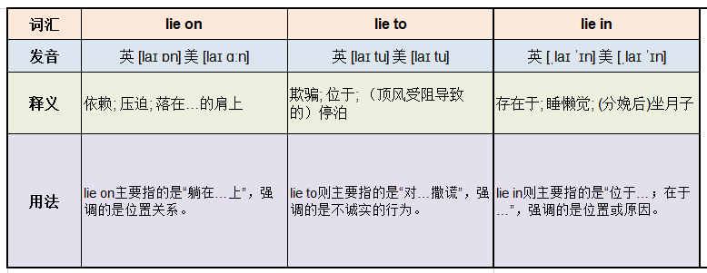

- [经济学人](https://gitee.com/yihoowang/Share/tree/main/Link)
- The reform of the healthcare system became a topic of crucial importance in the presidential election debate.
- It is that the chief proof of man's real greatness lies in his perception of his own smallness.
  - 
- The team's task is to devise a method to improve efficiency and reduce costs.