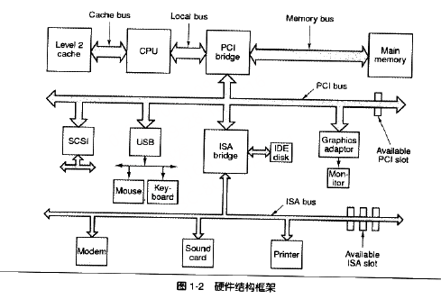
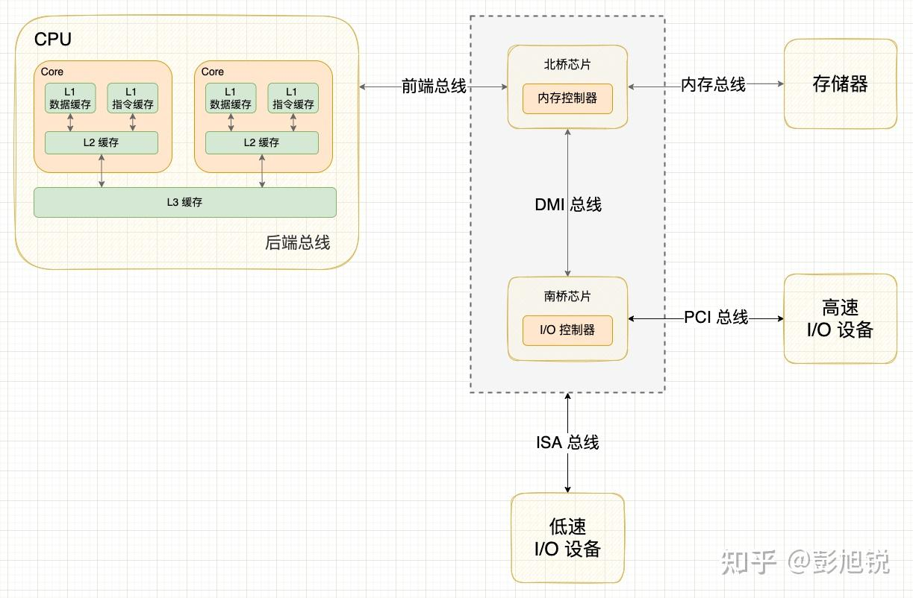
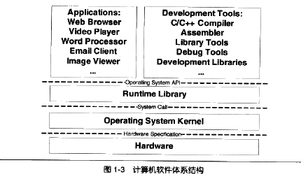

# Chapter1
1. 计算机硬件结构：
      - 软件开发者关注关键部件 : 中央处理器CPU/内存/IO控制芯片
      - 总线：
          - 早期CPU内存频率相同连接至同一总线，IO设备新增控制器用于通信
          - 后来CPU核心频率提升，新增与内存频率相同的系统总线，CPU与其倍频通信；GPU数据交换需求提升，IO总线无法满足，新增北桥用于高速交换数据，低速设备连接至南桥；
              - 
          - 扩展：[图解计算机内部的高速公路 —— 总线系统](https://zhuanlan.zhihu.com/p/583731508)
              - 总线就是连接多个计算机部件的数据通信规范
              - 总线的内部电路结构:地址总线/控制总线/数据总线
              - 总线系统的架构：单总线 /双独立总线(片内外区分前后端总线-因cache与内存速差过大) /南北桥架构 /片上北桥
              - 桥接器功能：1.缓冲功能: 南北桥芯片实现了两类总线信号速度缓冲; 2.桥接功能: 南北桥芯片实现了两类总线信号的转换, 有利于系统升级换代。
              - **现代计算机中的总线大多采用分层次多总线架构，由片内+片外双独立总线平衡高速缓存和内存的速度差，由南北桥架构平衡高速部件和低速部件的速度差**
              - 
2. 计算机软件体系架构：采用分层架构 “计算机科学领域的任何问题都可以通过增加一个间接的中间层来解决”
      - **应用程序** /*应用程序编程接口API*/ **运行库** /*系统调用接口*/ **操作系统内核Kernel** /*硬件规格*/ **硬件**
      - 