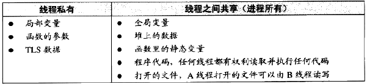

# Chapter1 前置相关理论简述
1. 计算机硬件结构：
      - 软件开发者关注关键部件 : 中央处理器CPU/内存/IO控制芯片
      - 总线：
          - 早期CPU内存频率相同连接至同一总线，IO设备新增控制器用于通信
          - 后来CPU核心频率提升，新增与内存频率相同的系统总线，CPU与其倍频通信；GPU数据交换需求提升，IO总线无法满足，新增北桥用于高速交换数据，低速设备连接至南桥；
              - 
          - 扩展：[图解计算机内部的高速公路 —— 总线系统](https://zhuanlan.zhihu.com/p/583731508)
              - 总线就是连接多个计算机部件的数据通信规范
              - 总线的内部电路结构:地址总线/控制总线/数据总线
              - 总线系统的架构：单总线 /双独立总线(片内外区分前后端总线-因cache与内存速差过大) /南北桥架构 /片上北桥
              - 桥接器功能：1.缓冲功能: 南北桥芯片实现了两类总线信号速度缓冲; 2.桥接功能: 南北桥芯片实现了两类总线信号的转换, 有利于系统升级换代。
              - **现代计算机中的总线大多采用分层次多总线架构，由片内+片外双独立总线平衡高速缓存和内存的速度差，由南北桥架构平衡高速部件和低速部件的速度差**
              - 
2. 计算机软件体系架构：采用分层架构 “计算机科学领域的任何问题都可以通过增加一个间接的中间层来解决”
      - **应用程序** /*应用程序编程接口API*/ **运行库** /*系统调用接口*/ **操作系统内核Kernel** /*硬件规格*/ **硬件**
            
3. CPU资源利用：
      - 多道程序(串行监控) / 分时系统 / **多任务系统**
      - 多任务系统：
          - 操作系统接管所有硬件资源，且运行在受硬件保护的级别；所有的应用程序都**以进程的方式**运行在低于操作系统的级别；
          - 每个进程都有自己**独立的地址空间**，使得各进程间地址空间隔离；
          - CPU分配方式为**抢占式**，操作系统可以强制剥夺且分配CPU资源至其认为最所需的进程；
4. 硬盘接口类型：**IDE**(ATA) : 兼容性强, 性价比高, 数据传输慢;  **SATA**(Serial ATA) : 串行接口, 数据传输带宽较高, 结构简单,取代IDE;  **SCSI** : 更高带宽与价格，多用于服务器.
5. 内存的地址空间隔离与使用效率提升：
      - 分段：虚拟地址映射，解决了地址空间不隔离与程序运行地址不确定问题，使用效率低
      - 分页：将内存空间分为一个个大小相等的分区(比如：每个分区4KB), 称“页帧”或“页框”;  将用户进程的地址空间也分为与页框大小相等的一个个区域, 称“页”或“页面”;  操作系统以页框为单位为各个进程分配内存空间。
        - 扩展：[分页系统的优势缺陷与执行步骤简述](https://developer.aliyun.com/article/1463649)
      - 存储器管理单元MMU：管理虚拟内存/内存保护/页映射与地址转换，一般集成在CPU内部
6. 线程：
      1. **是进程的子任务，是CPU调度和分派的基本单位，用于保证程序的实时性，实现进程内部的并发**；
      2. 各线程共享程序的内存空间(包括代码段,数据段,堆等)及一些进程级的资源(包括打开文件和信号)；
            
      3. 线程调度与转换：**优先级调度** 及 **时间片轮转法**
         - 线程优先级改变方式：用户指定/按进入等待状态频率动态修改/长时间未执行避免饿死
      4. 线程安全：详见[Linux系统编程相关笔记](../../Net_Note/notes/2023_3_17.md)
