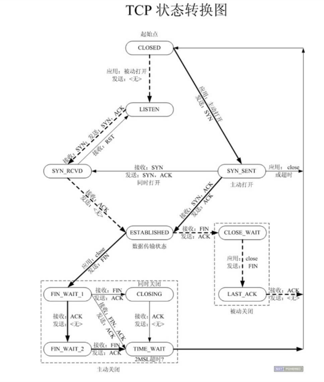
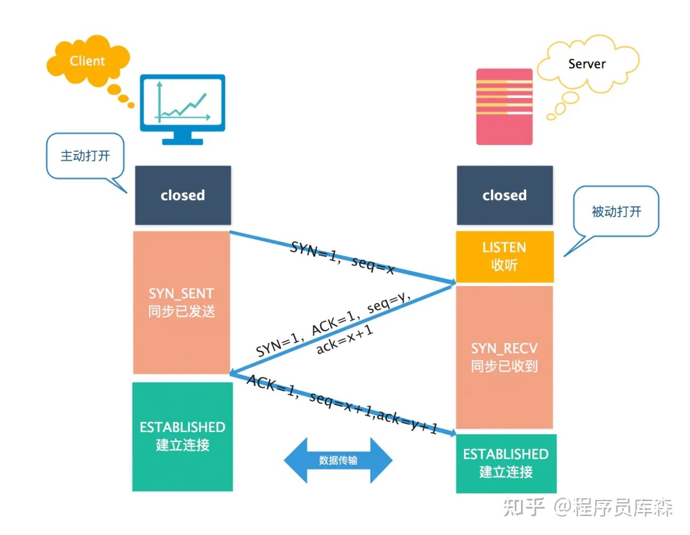
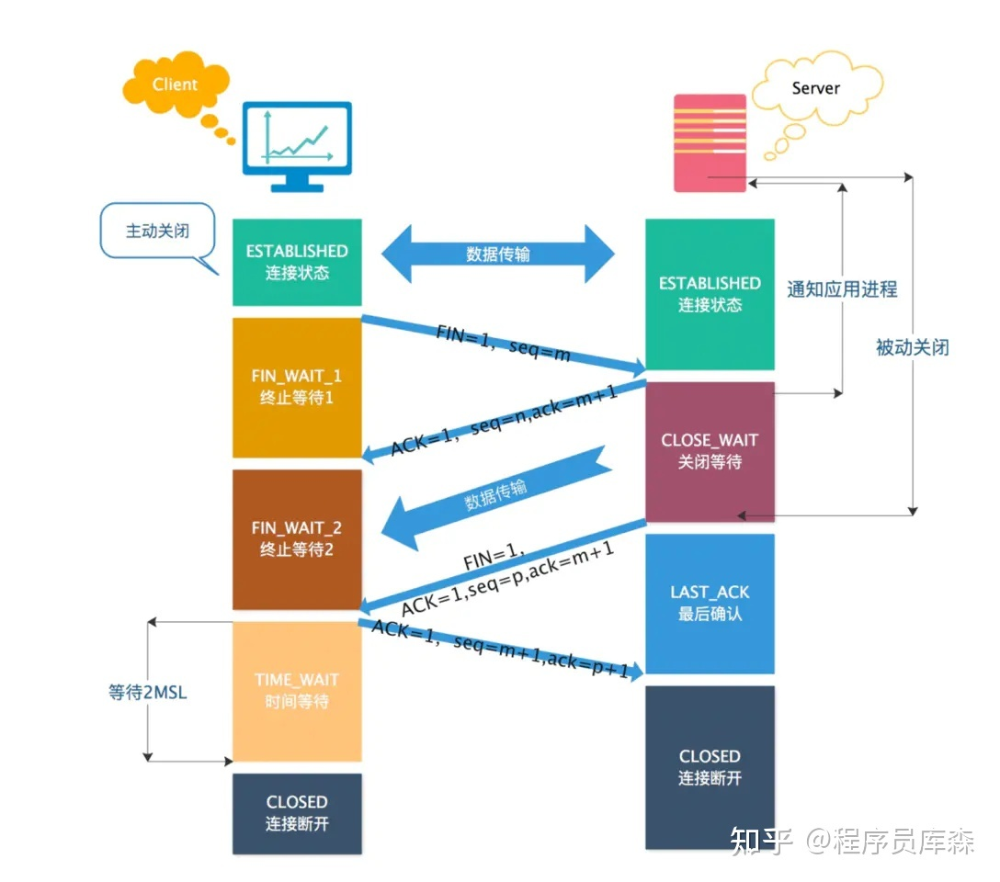

# 网络基础
## TCP状态转换图

- **netstat - apn | grep client 查看客户端的网络连接状态**
- **netstat - apn | grep port   查看端口的网络连接状态**

### 状态时序
- **三次握手**

   - 主动发起连接请求端：CLOSE -- 发送SYN -- **SEND_SYN** (同步已发送) -- 接收ACK、SYN -- SEND_SYN-- 发送ACK-- **ESTABLISHED**（数据通信态）
   - 被动接收连接请求端：CLOSE -- LISTEN -- 接收SYN -- LISTEN -- 发送ACK、SYN -- **SYN_RCVD** (同步已接受) -- 接收ACK-- **ESTABLISHED**（数据通信态）
- **四次挥手**

   - 主动关闭连接请求端：ESTABLISHED（数据通信态）-- 发送FIN -- **FIN_WAIT_1** -- 接收ACK-- **FIN_WAIT_2**（半关闭）-- 接收对端发送FIN -- FIN_WAIT_2（半关闭）-- 回发ACK-- **TIME_WAIT**（只有**主动关闭连接**方，会经历该状态）--等2MSL时长-- CLOSE
   - 被动关闭连接请求端：ESTABLISHED（数据通信态）-- 接收FIN -- ESTABLISHED（数据通信态）-- 发送ACK-- **CLOSE_WAIT** (说明对端【主动关闭连接端】处于半关闭状态)-- 发送FIN -- **LAST_ACK** -- 接收ACK-- CLOSE

### 端口复用函数
```cpp
int opt = 1;
setsockopt(lfd, SOL_SOCKET, SO_REUSEADDR, (void*)&opt);
```

### 半关闭
- **FIN_WAIT_2**
    - close(cfd);
    - shutdown(int fd, int how);
        how: SHUT_RD/ SHUT_WR/ SHUT_RDWR 指定关闭套接字的读写缓冲区
    - 两者差别为在关闭多个文件描述符指向的文件时, close只是减少一个描述符的引用计数, 不直接关闭连接;shutdown不考虑描述符的引用计数, 直接关闭描述符;

